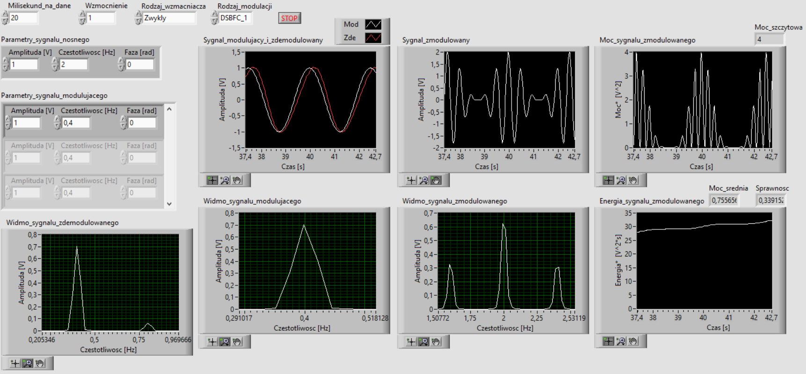
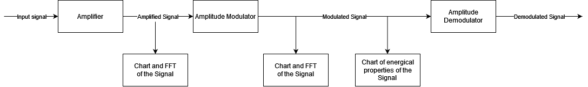
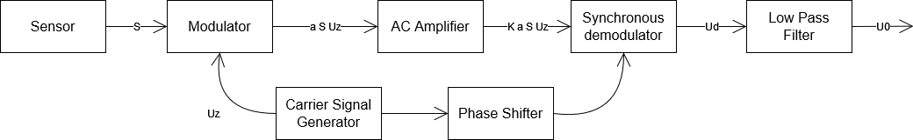
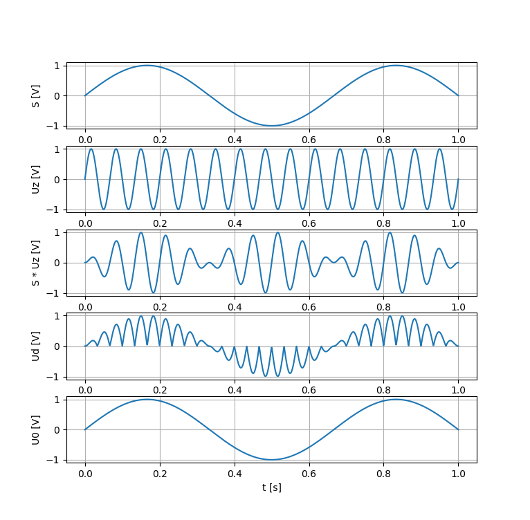
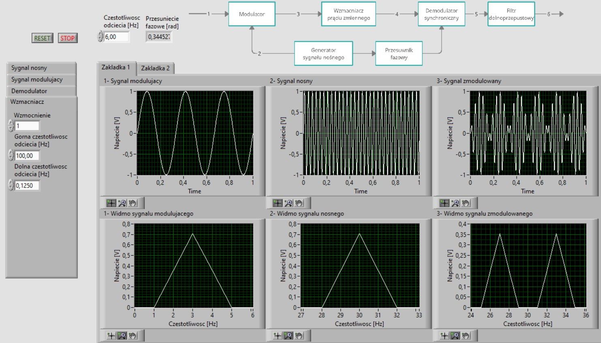
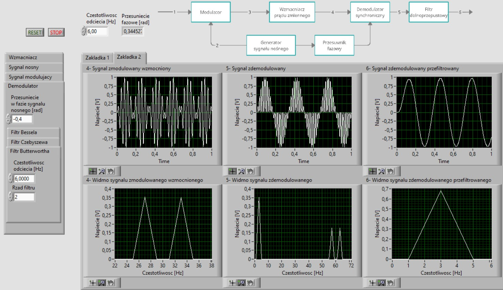

# Amplitude modulation

## Introduction

The scope of work in this project includes the creation of a virtual instrument in the LabView graphical environment, which will be used to analyze the properties of the voltage gain path with amplitude modulation for simulated signals.

This repo includes three documentations ([doc1.pdf](doc1.pdf), [doc2.pdf](doc2.pdf), [doc3.pdf](doc3.pdf)), which were created with development of this project. This [README.md](README.md) describes only practical aspect (source code) of the project. Theoretical knowledge is included in the mentioned documentations (in polish). For english source of theoretical knowledge check the bibliography attached to these documentations.

This project includes 2 simulation subprojects. Namely simulator of:
- amplitude modulation/demodulation,
- amplification path with amplitude modulation.

## Amplitude modulation/demodulation simulator

In next steps:
1. Input, harmonic, amplified signal is generated. This signal is visualised in the time (Chart 1) and in the frequency (Chart 5) domains. Signal is amplified using one of the possible amplifiers:
    1. ["normal" amplifier](res/Simulator1/Amplifier/Normal.png)
    1. [integrating amplifier](res/Simulator1/Amplifier/Integrating.png)
    1. [differential amplifier](res/Simulator1/Amplifier/Differential.png)
1. The input, harmonic, amplified signal is modulated using one of the possible amplitude modulators:
    1. [DSBFC](res/Simulator1/Modulation/DSBFC.png)
    1. [DSBSC](res/Simulator1/Modulation/DSBSC.png)
    1. [USBSC](res/Simulator1/Modulation/USBSC.png)
    1. [LSBSC](res/Simulator1/Modulation/LSBSC.png)
1. The modulated signal is visualised:
    1. in the time domain (Chart 2)
    1. in the frequency domain (Chart 6)
    1. in terms of it's energical properties (Chart 3 and 7) (see [Energical1](res/Simulator1/Chart/Energical1.png) and [Energical2](res/Simulator1/Chart/Energical2.png))
1. The modulated signal is demodulated in respect to technique of its modulation:
    1. [DSBFC1](res/Simulator1/Demodulation/DSBFC1.png), [DSBFC2](res/Simulator1/Demodulation/DSBFC2.png) (demodulation of the same signal in two different ways)
    1. [DSBSC](res/Simulator1/Demodulation/DSBSC.png)
    1. [SSBSC](res/Simulator1/Demodulation/SSBSC.png) for both USBSC and LSBSC
1. The demodulated signal is is visualised in the time (Chart 1) and in the frequency (Chart 4) domains to check correctness of everything.

Test of (results):
1. [DSBFC1](res/Simulator1/Test/DSBFC1.png)
1. [DSBFC2](res/Simulator1/Test/DSBFC2.png)
1. [DSBSC](res/Simulator1/Test/DSBSC.png)
1. [USBSC](res/Simulator1/Test/USBSC.png)

Helper functions used above:
1. [Sine wave generator](res/Simulator1/Helper/SineWaveGenerator.png)
1. [Harmonic wave generator](res/Simulator1/Helper/HarmonicWaveGenerator.png)
1. [Phase shifter](res/Simulator1/Helper/PhaseShifter.png) used in USBSC and LSBSC

Trivia:
1. [Phase synchronizer of the carrier signal that is part of the modulated, DSBSC signal with the locally generated carrier signal](res/Simulator1/Trivia/PhaseSynchronizer_DSBSC.png)
1. ["Real signal" USBSC modulator](res/Simulator1/Trivia/RealSignalModulator_USBSC.png)
1. ["Real signal" USBSC modulator test](res/Simulator1/Test/OfModulation_USBSC.png)
1. ["Real signal" LSBSC modulator](res/Simulator1/Trivia/RealSignalModulator_LSBSC.png)
1. [Filter Characteristics](res/Simulator1/Trivia/FilterCharacteristics.jpg)

## Amplification path with amplitude modulation simulator

### Introduction

"Amplification path with amplitude modulation" was described (in polish) in [doc3.pdf](doc3.pdf) in chapter 1. This path will be described here shortly. Its block diagram is as follows:

where:
- $S$ is a sensor's signal,
- $U_z$ is a carrier signal,
- $a \cdot S \cdot U_z$ is a modulated signal,
- $K \cdot a \cdot S \cdot U_z$ is a signal amplified using AC amplifier (high pass filter + "normal" amplifier),
- $U_d = \text{sign} (U_z) |K \cdot a \cdot S \cdot U_z|$ is a demodulated signal,
- $U_0$ is a information signal (gained by using low pass filter on signal $U_d$).

Chart of the signals is as follows:

Front panels of this simulator are shown below:

1. The sensor's signal is simulated as:
    1. [Sinusoidal](res/Simulator2/SignalGenerator/Sinusoid.jpg)
    1. [Square](res/Simulator2/SignalGenerator/Square.jpg)
    1. [Triangle](res/Simulator2/SignalGenerator/Triangle.jpg)
    1. [Harmonic signal with 3 components](res/Simulator2/SignalGenerator/HarmonicOf3.jpg)
1. The signal is modulated, amplified, and demodulated [as follows](res/Simulator2/Step1.jpg).
1. The information signal is gained [as follows](res/Simulator2/Step2.jpg).
1. Phase synchronizer of the carrier signal that is part of the modulated, DSBSC signal with the locally generated carrier signal is constructed [as follows](res/Simulator2/PhaseSynchronizer_DSBSC.jpg).