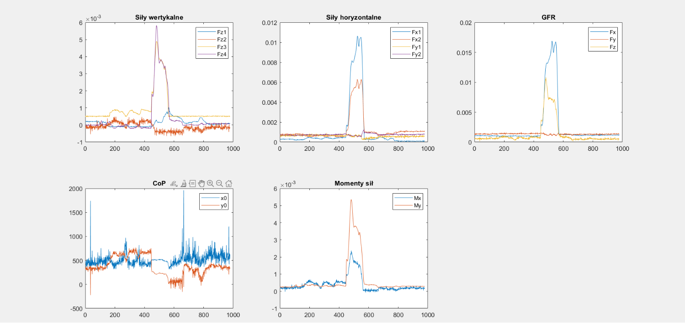
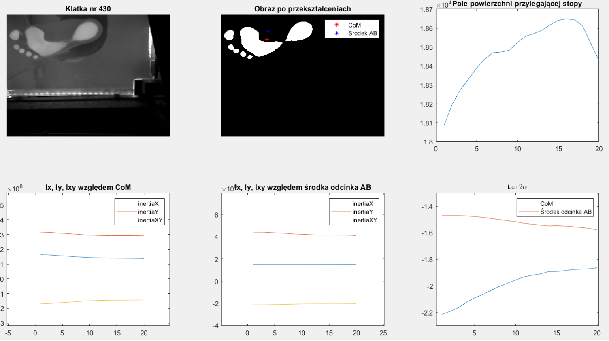
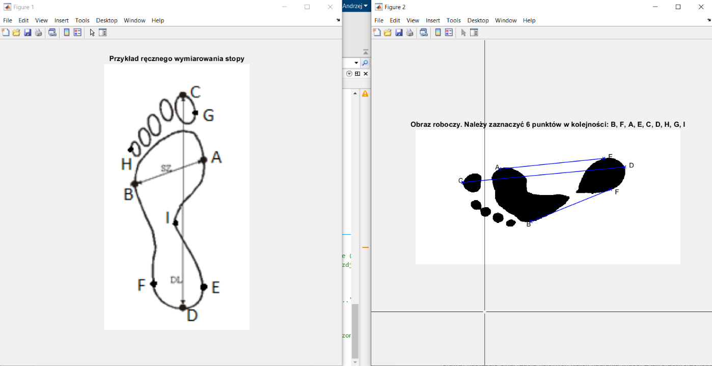

# Podoscopy

The aim of the project is determination of diagnostic parameters for the data acquired using podoscopy platform. The data consists of:

- sequential images of footprints made during natural gait,
- reaction of the ground as a result of foot pressure on the podoscopy platform.

## About the source code (written in MATLAB)

Everything was put into [main.m script](src/main.m), all the other scripts are helper functions. In the next steps (in the main.m script) the data is loaded (video and tensometric data) and visualised.

### Visualization of the ground reaction forces

The chart visualise:

1. vertical forces acted on the platform,
1. horizontal forces acted on the platform,
1. [Ground Force Reactions (GFR)](src/Re.m) acted on the foot,
1. [Center of Pressure (CoP)](src/COP.m) on the platform,
1. [Torques](src/Torque.m) acted on the platform.

### Visualization of the sequential images of the footprints

The chart visualise (sequential images of the footprints):

1. acquired, raw image,
1. image after binarization (+ [Center of Mass](src/COM.m) of the binary image and the midpoint of the line segment connecting end points of the big toe and hell (in short the midpoint of the AB line segment)),
1. surface area of ​​the adjacent foot in time,
1. [moments of inertia of the image calculated with respect to Center of Mass](src/MomentOfInertia.m) in time,
1. [moments of inertia of the image calculated with respect to the midpoint of the AB line segment](src/MomentOfInertia2.m) in time,
1. [tan(2*alpha)](src/Param1.m) in time (The function counts tan(2*alpha). alpha defines the best fit x'y' frame of reference (obtained by rotating the primary frame relative to its origin by the angle alpha) such that Ix' and Iy' reach the extremes (max and min).)

### Plantocontourogram

[Plantocontourograph.m script](src/Plantocontourograph.m) allows to calculate (manually) diagnostic parameters for the footprint such as: Clark's index, Wejsflog index and angles: hallux valgus, little toe valgus and calcaneus. In order to run it properly, a variable containing the initial image and the name of the file where the image after transformations should be saved should be attached to the call. At the beginning, the script displays the diagram of the foot with marked points necessary for further calculations and the image of the analyzed foot at the moment of its greatest contact with the surface of the podoscopic platform. Successive points should be determined in the correct order, which are returned by the function in the form of an array of numbers (angle measures are given in radians, but they can be converted to degrees).

### What can be improved

[Plantocontourograph.m script](src/Plantocontourograph.m) should work automatically.