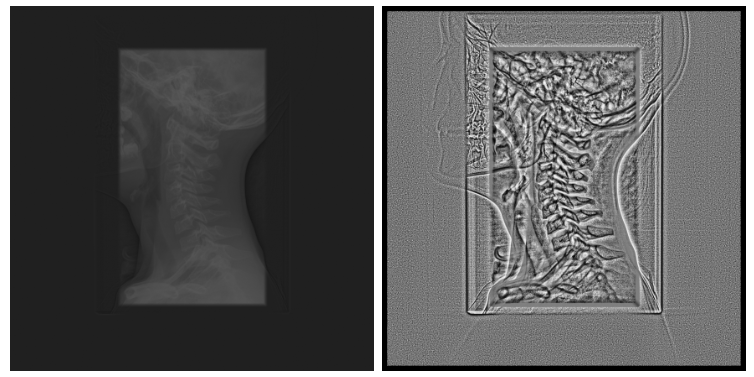

# Statistical Dominance Algorithm

This is project created as part of [my master's thesis (written in polish)](doc.pdf). The aim of this project is implementation of [Statistical Dominance Algorithm](https://home.agh.edu.pl/~pioro/sda/) as [3D Slicer](https://www.slicer.org/) extensions.

## About the algorithm

The Statistical Dominance Algorithm, abbreviated as SDA, for each pixel of a grayscale photo examines it in relation to its neighborhood. For example, the value of a pixel in the result grayscale photo depends on the number of (in the absolute sense understood) neighbors of the corresponding pixel having a value greater/lesser than this central pixel. The algorithm depends on the adopted: neighborhood (masks), relationship between the examined pixel and its neighbourhood and optional threshold value. The SDA algorithm is used in: detecting small objects, segmentation, edge detection, digital image normalization, and the like.

The SDA algorithm sequentially applies a mask in every place of the monochrome image, which determines the neighborhood of the examined pixel. Number of neighbors satisfying the given relation (with the given threshold value) is the value assigned to the resulting photo in the place of the examined pixel. Algorithm in turn consists of:

1. processing the command line arguments controlling the operation of algorithm,
2. loading a monochrome input photo,
3. possible negation of this input photo,
4. defining the appropriate mask,
5. SDA algorithm run,
6. normalization of the monochrome image of the resulting SDA algorithm to a value in the range 0 - 255,
7. showing the resulting photo,
8. saving the resulting photo.

## About implementations

The algorithm was implemented as:

1. [Python script](src/SDA.py),
2. [Scripted Slicer 3D module](src/scriptedModule/scriptedModule.py),
3. [Command Line Interface module](src/Extension/cliModule/),
4. [Loadable module](src/Extension/loadableModule/).

For verifying correctness of the implementations, [script](src/Comparison.py) calculating differential image was written. Important steps taken upon the process of implementation were presented in [short videos](VideoPresentation). The whole process of implementation was throughly described in (polish language) [doc.pdf](doc.pdf).

## What can be improved

The SDA algorithm should be implemented to work on GPU.